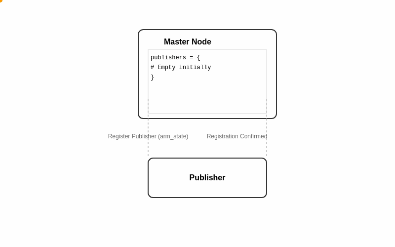
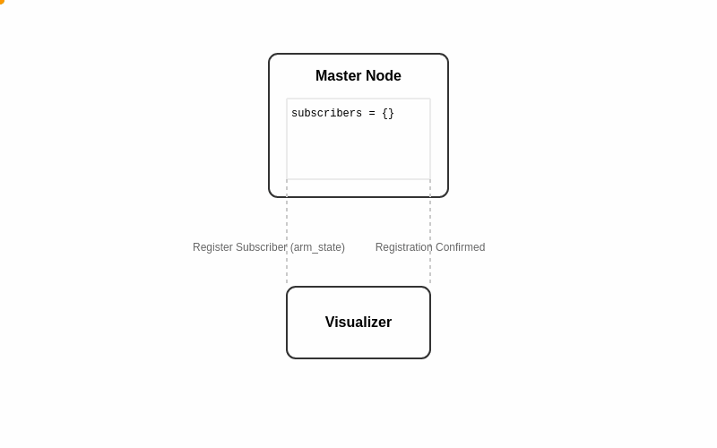
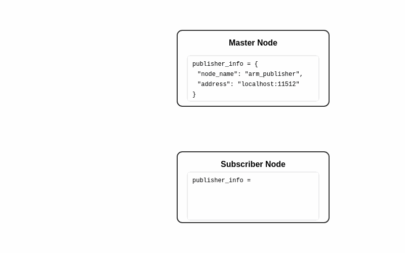

# ROS-Like System Architecture

This document provides a detailed overview of the ROS-like system's architecture, including its core components, communication patterns, and registration processes.

## System Overview

The system implements a publish-subscribe (pub/sub) architecture with a central master node, similar to ROS (Robot Operating System). This architecture enables:
- Decentralized communication between nodes
- Dynamic node discovery and registration
- Topic-based message routing
- Asynchronous communication

## Core Components

### 1. Master Node
- Acts as the central coordinator
- Manages node registrations
- Maintains publisher and subscriber information
- Facilitates node discovery and connections

### 2. Publisher Nodes
- Register with the master node
- Publish messages on specific topics
- Can have multiple subscribers
- Run independently of subscribers

### 3. Subscriber Nodes
- Register with the master node
- Receive messages from publishers
- Can subscribe to multiple topics
- Receive publisher connection details from master

## Registration Process

### Publisher Registration


The publisher registration process involves:
1. Publisher sends registration message to master
2. Master stores publisher information:
   - Node name
   - Topic
   - Network address
3. Master confirms registration
4. Publisher begins waiting for subscriber connections

### Subscriber Registration


When a subscriber wants to receive messages:
1. Subscriber sends registration request to master
2. Master updates subscriber list for the topic
3. Master sends confirmation to subscriber
4. Subscriber is added to the distribution list

## Connection Establishment


After registration, nodes establish connections:
1. Master provides publisher connection details to subscriber
2. Subscriber stores publisher information
3. Direct connection is established between publisher and subscriber
4. Messages flow directly between nodes

## Message Flow

### Registration Messages
Special message types used during setup:
- `__registration__`: Node registration with master
- `__publisher_registration__`: Publisher topic registration
- `__subscriber_registration__`: Subscriber topic registration
- `__publisher_info__`: Connection details for subscribers

### Data Messages
Regular messages contain:
- Topic name
- Message data
- Timestamp
- Source node information
- Unique message ID

## Network Layer

The system uses:
- TCP/IP for reliable communication
- JSON serialization for messages
- Asynchronous I/O with Python's asyncio
- Automatic reconnection handling

## Implementation Details

### Core Classes

1. `NetworkNode`
- Base networking functionality
- Connection management
- Message serialization/deserialization

2. `Node`
- Publisher/Subscriber functionality
- Topic management
- Message handling

3. `Master`
- Registration handling
- Node tracking
- Message routing

### Message Structure
```python
@dataclass
class Message:
    topic: str
    data: Any
    timestamp: float
    message_id: str
    source_node: Optional[str]
```

## Error Handling

The system includes:
- Connection retry mechanisms
- Error logging
- Exception handling
- Graceful shutdown procedures

## Usage Examples

See the [README.md](README.md) for detailed usage examples and the `examples/` directory for implementation examples.
